# clojure-lsp Development

## Codebase architecture 

The codebase is dense but well structured, the diagram below will help understand the layers making easier to understand where you need to make your changes.

```mermaid
---
config:
theme: dark
---
flowchart TB
subgraph Clients["Clients"]
       VSCode["VS Code<br>(Calva)"]
       Emacs["Emacs<br>(lsp-mode / eglot)"]
       Vim["Vim/Neovim"]
       IntelliJ["IntelliJ<br>(clojure-lsp-intellij)"]
       REPL["Repl"]
       OtherEditors["Other editors"]
 end
subgraph subGraph1["Cli (cli/)"]
       CLIMain["Process<br>(main.clj)"]
       LSPServer["LSP Server<br>(server.clj)"]
 end
subgraph subGraph2["Core Services"]
       Handlers["Features handlers<br>(handlers.clj)"]
       Startup["Startup &amp; Init<br>(startup.clj)"]
       Config["Configuration<br>(config.clj)"]
       DB["Database<br>(db.clj)"]
 end
subgraph subGraph3["Analysis Engine"]
       KondoIntegration["clj-kondo Integration<br>(kondo.clj)"]
       Parser["Parser<br>(parser.clj)"]
       Queries["Analysis Queries<br>(queries.clj)"]
       DepGraph["Dependency Graph<br>(dep_graph.clj)"]
 end
subgraph subGraph4["Feature Implementations"]
       Completion["Completion<br>(completion.clj)"]
       Diagnostics["Diagnostics<br>(diagnostics.clj)"]
       CodeActions["Code Actions<br>(code_actions.clj)"]
       Rename["Rename<br>(rename.clj)"]
       Hover["Hover<br>(hover.clj)"]
       References["Find References"]
       Format["Formatting<br>(format.clj)"]
       Refactoring["Refactoring Features"]
 end
subgraph subGraph5["Support Systems"]
       FileManagement["File Management<br>(file_management.clj)"]
       Classpath["Classpath Resolution<br>(classpath.clj)"]
       SourcePaths["Source Paths<br>(source_paths.clj)"]
       Logger["Logging<br>(logger.clj)"]
 end
subgraph subGraph6["Core Library (lib/)"]
       API["Public API<br>(api.clj)"]
       InternalAPI["Internal API<br>(internal_api.clj)"]
       subGraph2
       subGraph3
       subGraph4
       subGraph5
 end
subgraph subGraph7["External Tools"]
       CljKondo["clj-kondo<br>(Static Analysis)"]
       Cljfmt["cljfmt<br>(Code Formatting)"]
       CljDepend["clj-depend<br>(Dependency Analysis)"]
       ClojureDocs["ClojureDocs<br>(Documentation)"]
 end
subgraph subGraph8["File System"]
       ProjectFiles["Project Source Files<br>(.clj, .cljs, .cljc)"]
       ConfigFiles["Config Files<br>(deps.edn, project.clj)"]
       Dependencies["Dependencies<br>(JARs, Git repos)"]
       CacheFiles["Cache Files<br>(.clj-kondo, .lsp)"]
 end
 VSCode --> CLIMain
 Emacs --> CLIMain
 Vim --> CLIMain
 OtherEditors --> CLIMain
 CLIMain --> API & LSPServer
 LSPServer --> Handlers
 REPL --> API
 API --> InternalAPI
 Handlers --> InternalAPI & Completion & Diagnostics & CodeActions & Rename & Hover & References & Format & Refactoring
 InternalAPI --> Startup & Config & DB
 Startup --> KondoIntegration & Classpath & SourcePaths
 KondoIntegration --> CljKondo & Parser & CacheFiles
 Format --> Cljfmt
 DepGraph --> CljDepend
 Hover --> ClojureDocs
 Parser --> Queries
 Queries --> DB
 Completion --> Queries
 Diagnostics --> Queries
 CodeActions --> Queries
 Rename --> Queries
 References --> Queries
 FileManagement --> ProjectFiles & ConfigFiles
 Classpath --> Dependencies
 CLIMain:::entryPoint
 LSPServer:::entryPoint
 Handlers:::coreService
 Startup:::coreService
 Config:::coreService
 DB:::coreService
 KondoIntegration:::coreService
 Parser:::coreService
 Completion:::feature
 Diagnostics:::feature
 CodeActions:::feature
 Rename:::feature
 Hover:::feature
 References:::feature
 Format:::feature
 Refactoring:::feature
 CljKondo:::external
 Cljfmt:::external
 CljDepend:::external
 ClojureDocs:::external
 ProjectFiles:::storage
 ConfigFiles:::storage
 Dependencies:::storage
 CacheFiles:::storage
 classDef entryPoint fill:#e1f5fe
 classDef coreService fill:#f3e5f5
 classDef feature fill:#e8f5e8
 classDef external fill:#fff3e0
 classDef storage fill:#fce4ec
```


<details>
<summary><b>visualization above's code</b></summary>


</details>

## Coding

There are several ways of finding and fixing a bug or implementing a new feature:

- [The Clojure Way](#the-clojure-way)
- Create a test for your bug/feature, then implement the code following the test (TDD).
- Build `clojure-lsp[.bat]` using `bb debug-cli` each time you have made changes, and test it manually in your client. This is the slowest option.

Whichever development path you choose: For final testing, it is good to rebuild the binary with `bb debug-cli`.

There are two custom LSP methods `clojure/serverInfo/log` and `clojure/cursorInfo/log`. They can assist in debugging.

### The Clojure Way

With a **clojure-lsp + [nREPL](https://nrepl.org)** powered Clojure editor you can modify your editor session's clojure-lsp server using the Clojure REPL.

Here's demo video: https://www.youtube.com/watch?v=4UvT0yqBDw8

These are the steps:

1. `bb debug-cli` - to build a `clojure-lsp[.bat]` executable that includes cider-nrepl in the jar. This executable will be saved at the root of the project.
1. Configure your editor to use this `clojure-lsp[.bat]` executable
1. Have your editor restart its clojure-lsp server
1. Issue the clojure-lsp `serverInfo` command
1. Find the `port` entry in the output
1. Connect your editors nREPL client to this port
1. Hack away!

**Seeing is believing.** An easy way to convince yourself that you can actually change clojure-lsp mid-flight is to:

1. Modify the `server-info` function in `lib/src/clojure_lsp/feature/development_info.clj`
    - Say, you add a `:foo :bar` entry to the map returned
1. Evaluate the new `server-info` function definition
1. Issue the clojure-lsp `serverInfo` command
1. Find `:foo :bar` in the output

You have just modified the LSP server powering your editor while it was running! This is the Clojure way. No recompiling and restarting and reloading. That is some other, non-Clojure, way.

The details in how to perform these steps can vary a bit between the various Clojure editors/plugins.

#### Visual Studio Code with Calva

* This project comes with [Calva](https://calva.io) configuration to use the `clojure-lsp[.bat]` executable built in step 1 above. You can skip step 2, unless are running on MS-Widnows, in which case you should update the setting in `.vscode/settings.json` to add the `.bat` extension, i.e. `"calva.clojureLspPath": "./clojure-lsp.bat"`.

* To restart the clojure-lsp server, use the VS Code command **Developer: Reload Window**
* The **Hack away!** step needs to start with you issuing the command **Calva: Load Current File and Dependencies**.

#### Emacs with CIDER

* To configure Emacs to use the nREPL-enabled executable, run `(setq lsp-clojure-custom-server-command '("~/path/to/clojure-lsp/clojure-lsp"))`, adjusting the path as necessary. If you add this to your Emacs config, you can skip this step in the future.
* To restart the clojure-lsp server, execute the Emacs command `lsp-workspace-restart`.
* To find the server info, execute `lsp-clojure-server-info`.
* To connect the nREPL client, run `cider-connect-clj`, with "localhost" and the port.

If you re-connect regulary, you may want to add this Emacs shortcut:

```emacs-lisp
(defun lsp-clojure-nrepl-connect ()
  "Connect to the running nrepl debug server of clojure-lsp."
  (interactive)
  (let ((info (lsp-clojure-server-info-raw)))
    (save-match-data
      (when-let (port (and (string-match "\"port\":\\([0-9]+\\)" info)
                           (match-string 1 info)))
        (cider-connect-clj `(:host "localhost"
                             :port ,port))))))
```

#### Vim with coc.nvim and Fireplace

* Change `coc-settings.json` (`:CocConfig`) `clojure-lsp: {command: "~/path/to/clojure-lsp/clojure-lsp"}`, adjusting the past as necessary.
* To restart the clojure-lsp server use `:CocRestart`
* To find the server info, `:echo CocRequest('clojure-lsp', 'clojure/serverInfo/raw')['port']`
* To find the server log, `:echo CocRequest('clojure-lsp', 'clojure/serverInfo/raw')['log-path']`
* To connect the nREPL client, run `:Connect <port>`

If you re-connect regulary, you may want to add something like this to your vimrc:

```viml
" Copies the log-path to your clipboard
nnoremap <silent> crsl :call setreg('*', CocRequest('clojure-lsp', 'clojure/serverInfo/raw')['log-path'])<CR>
" Connects to nrepl
nnoremap <silent> crsp :execute 'Connect' CocRequest('clojure-lsp', 'clojure/serverInfo/raw')['port']<CR>
```

#### Neovim with Conjure

* Change the lsp [config](https://github.com/neovim/nvim-lspconfig/blob/master/doc/server_configurations.md#clojure_lsp) `cmd` to "~/path/to/clojure-lsp/clojure-lsp", adjusting the path as necessary.
* To [restart](https://neovim.io/doc/user/lsp.html#lsp-faq) the LSP:
  * To stop the clojure-lsp server, use `:lua vim.lsp.stop_client(vim.lsp.get_active_clients())`
  * To start the clojure-lsp server, use `:edit`
* To find the server info or the log file, use `:lua clients = vim.lsp.get_active_clients() for k, client_data in ipairs(clients) do id = client_data.id end client = vim.lsp.get_client_by_id(id) result = client.request_sync("clojure/serverInfo/raw", {}, 5000, 15) print('port = ' .. result.result.port) print('log-path = ' .. result.result['log-path'])`
* To connect the nREPL client, run `:ConjureConnect <port>`

### Debugging & Profiling

The nREPL includes tools for debugging and profiling clojure-lsp. See `cli/dev/clojure_lsp/debug.clj`.

If you're interested in using the profiling tools in that file, you'll need to be familiar with [criterium](https://github.com/hugoduncan/criterium) and [clj-async-profiler](http://clojure-goes-fast.com/blog/profiling-tool-async-profiler/).

Note that the performance of clojure-lsp is highly dependent on the size of its db. If you load a repl with `-A:build`, you'll have access to the debugging tools, but the db will be nearly empty. Follow the [steps][#the-clojure-way] above to connect to an nREPL which has a populated db.

### Testing

Run `bb tasks` for a list of available dev tasks.

The codebase consists of the `lib/` library and the `cli/` program which depends on it.

1. `bb test-lib`,
1. `bb test-cli`, and
1. `bb test` (for both of the above).

`cli/` produces a standalone `.jar` file that can be converted to a self contained `clojure-lsp[.bat]` script or a `clojure-lsp[.exe]` binary executable file.

1. `bb prod-jar` -> `cli\` standalone jar,
1. `bb prod-cli` -> executable script with embedded `cli/` jar,
1. `bb debug-cli` -> same as `prod-cli` but includes support for `cider-nrepl` and `clj-async-profile`, and
1. `bb native-cli` -> binary executable produced with `graalvm`.

There are also `cli/` integration tests. They require `./clojure[.bat|.exe]` to have already been built with one of the above cli tasks (__NOTE:__always ensure that you rebuild the `cli/` executable every time you make changes to `lib/` or `cli/` source code so tha the integration tests use an up to date executable).

1. `bb integration-test`

The same development version can be used to lint all of the source code.

1. `bb lint`

#### Writing tests

A test should be able to run on all JDK versions in scope starting with 1.8 and across `GNU/Linux`, `macos` and `MS-Windows` operating systems.

The test author should be aware of the following important differences between *nix and windows:

1. Line endings
    1.  On *nix: the single Line Feed (LF) char, i.e. `\n`.
    1.  On windows: the Carriage Return (CR) followed by the LF char (CRLF), i.e. `\r\n`.
1. Paths
    1. On *nix: Use `/` as the path separator, absolute paths start with `/`.
    1. On windows: use `\` as the path separator, absolute paths start either with a drive letter followed by `:\`, i.e. `[A-Za-Z]:\` (e.g. `c:\temp` and `D:\src`) or with a double `\\` indicating a network path (e.g. `\\computer39\temp`).

Below are a few __hints__ to assist with writing test that work accross the different platforms.

1. Line Endings
    1. When comparing strings, Use `clojure-lsp.test-helper.internal/string=` with `\n` in your expected result.
        1. e.g. use `(is (h/strings= "one\n" result)` instead of `(is (= "one\r\n" result))` or `(is (= "one\n" result))`.
    1. Use `h/str-includes?` with `\n` in the string to search for instead of `clojure.string/includes?`.
        1. e.g. `(is (h/str-includes? (slurp "path") "something\n"))` instead of `(is (str/includes? (slurp "path") "something\n"))` or `(is (str/includes? (slurp "path") "something\r\n"))`.
2. Paths
    1. Always use `babashka.fs/canonicalize` when converting a relative path to an absolute path. Avoiding using any of java File/Path absolute or canonical equivalent fns. This ensures that the drive letter on windows is always in capitals (e.g. `D:\` instead of `d:\`). This is also the convention used throughout the codebase and it works as well with both existing and non-existing files.
    1. Use `clojure-lsp.test-helper.internal/file-path`, `clojure-lsp.test-helper.internal/file->uri` with *nix paths. They are converted to the format expected by the OS.
        1. e.g. `(load-code (h/file-path "/aaa.clj")  "(ns aaa)")` instead of `(load-code "/aaa.clj" "(ns aaa)")` or `(load-code "c:\\aaa.clj" "(ns aaa)")`

