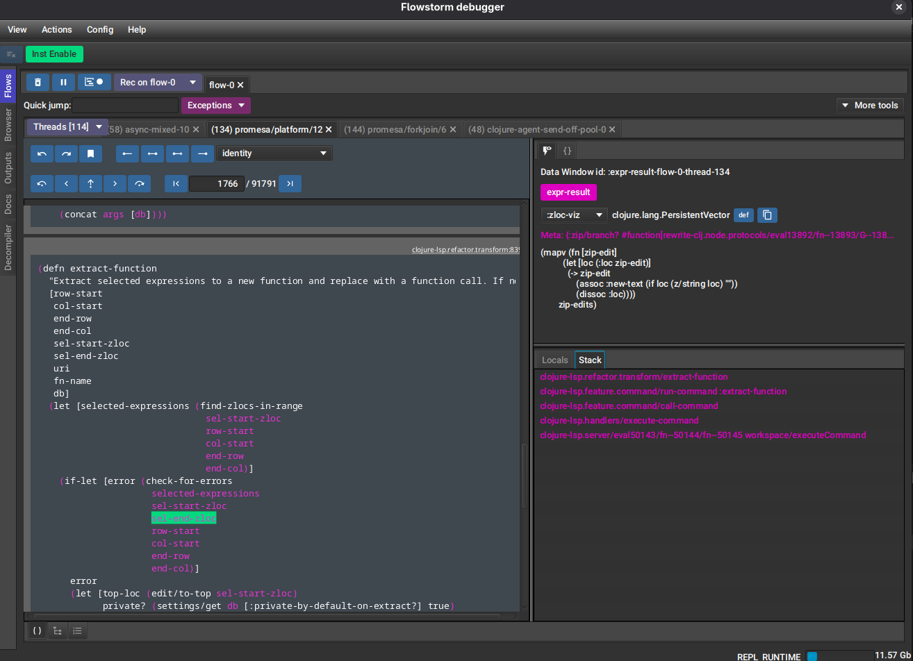
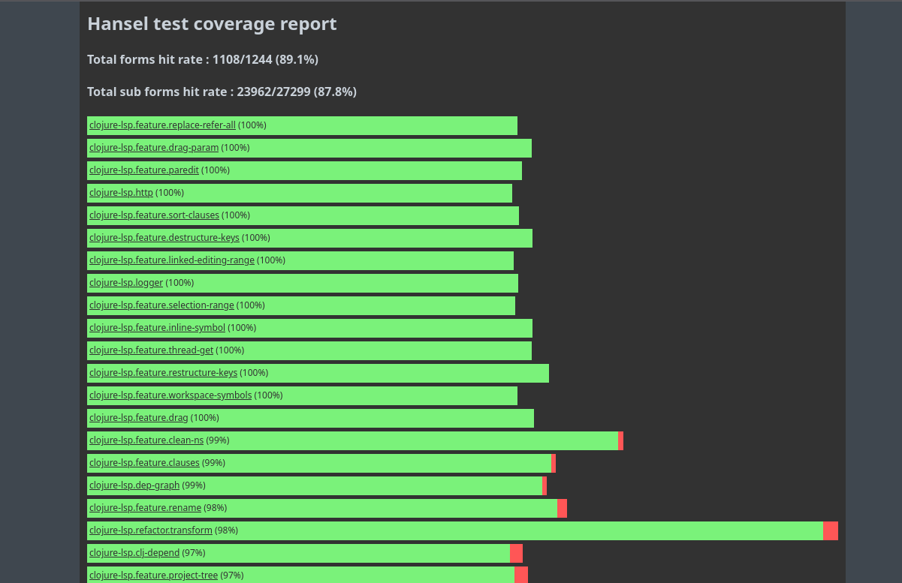
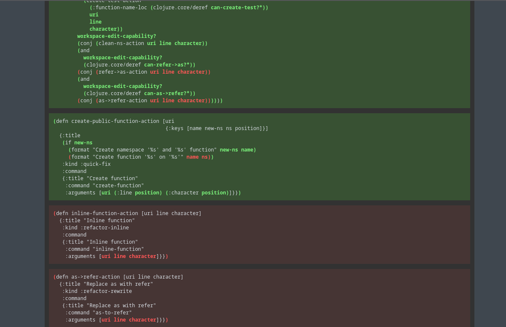

# clojure-lsp Development

## Codebase architecture 

The codebase is dense but well structured, the diagram below will help understand the layers making easier to understand where you need to make your changes.



<details>
<summary><b>visualization above's code</b></summary>


```mermaid
---
config:
theme: dark
---
flowchart TB
subgraph Clients["Clients"]
       VSCode["VS Code<br>(Calva)"]
       Emacs["Emacs<br>(lsp-mode / eglot)"]
       Vim["Vim/Neovim"]
       IntelliJ["IntelliJ<br>(clojure-lsp-intellij)"]
       REPL["Repl"]
       OtherEditors["Other editors"]
 end
subgraph subGraph1["Cli (cli/)"]
       CLIMain["Process<br>(main.clj)"]
       LSPServer["LSP Server<br>(server.clj)"]
 end
subgraph subGraph2["Core Services"]
       Handlers["Features handlers<br>(handlers.clj)"]
       Startup["Startup &amp; Init<br>(startup.clj)"]
       Config["Configuration<br>(config.clj)"]
       DB["Database<br>(db.clj)"]
 end
subgraph subGraph3["Analysis Engine"]
       KondoIntegration["clj-kondo Integration<br>(kondo.clj)"]
       Parser["Parser<br>(parser.clj)"]
       Queries["Analysis Queries<br>(queries.clj)"]
       DepGraph["Dependency Graph<br>(dep_graph.clj)"]
 end
subgraph subGraph4["Feature Implementations"]
       Completion["Completion<br>(completion.clj)"]
       Diagnostics["Diagnostics<br>(diagnostics.clj)"]
       CodeActions["Code Actions<br>(code_actions.clj)"]
       Rename["Rename<br>(rename.clj)"]
       Hover["Hover<br>(hover.clj)"]
       References["Find References"]
       Format["Formatting<br>(format.clj)"]
       Refactoring["Refactoring Features"]
 end
subgraph subGraph5["Support Systems"]
       FileManagement["File Management<br>(file_management.clj)"]
       Classpath["Classpath Resolution<br>(classpath.clj)"]
       SourcePaths["Source Paths<br>(source_paths.clj)"]
       Logger["Logging<br>(logger.clj)"]
 end
subgraph subGraph6["Core Library (lib/)"]
       API["Public API<br>(api.clj)"]
       InternalAPI["Internal API<br>(internal_api.clj)"]
       subGraph2
       subGraph3
       subGraph4
       subGraph5
 end
subgraph subGraph7["External Tools"]
       CljKondo["clj-kondo<br>(Static Analysis)"]
       Cljfmt["cljfmt<br>(Code Formatting)"]
       CljDepend["clj-depend<br>(Dependency Analysis)"]
       ClojureDocs["ClojureDocs<br>(Documentation)"]
 end
subgraph subGraph8["File System"]
       ProjectFiles["Project Source Files<br>(.clj, .cljs, .cljc)"]
       ConfigFiles["Config Files<br>(deps.edn, project.clj)"]
       Dependencies["Dependencies<br>(JARs, Git repos)"]
       CacheFiles["Cache Files<br>(.clj-kondo, .lsp)"]
 end
 VSCode --> CLIMain
 Emacs --> CLIMain
 Vim --> CLIMain
 OtherEditors --> CLIMain
 CLIMain --> API & LSPServer
 LSPServer --> Handlers
 REPL --> API
 API --> InternalAPI
 Handlers --> InternalAPI & Completion & Diagnostics & CodeActions & Rename & Hover & References & Format & Refactoring
 InternalAPI --> Startup & Config & DB
 Startup --> KondoIntegration & Classpath & SourcePaths
 KondoIntegration --> CljKondo & Parser & CacheFiles
 Format --> Cljfmt
 DepGraph --> CljDepend
 Hover --> ClojureDocs
 Parser --> Queries
 Queries --> DB
 Completion --> Queries
 Diagnostics --> Queries
 CodeActions --> Queries
 Rename --> Queries
 References --> Queries
 FileManagement --> ProjectFiles & ConfigFiles
 Classpath --> Dependencies
 CLIMain:::entryPoint
 LSPServer:::entryPoint
 Handlers:::coreService
 Startup:::coreService
 Config:::coreService
 DB:::coreService
 KondoIntegration:::coreService
 Parser:::coreService
 Completion:::feature
 Diagnostics:::feature
 CodeActions:::feature
 Rename:::feature
 Hover:::feature
 References:::feature
 Format:::feature
 Refactoring:::feature
 CljKondo:::external
 Cljfmt:::external
 CljDepend:::external
 ClojureDocs:::external
 ProjectFiles:::storage
 ConfigFiles:::storage
 Dependencies:::storage
 CacheFiles:::storage
 classDef entryPoint fill:#e1f5fe
 classDef coreService fill:#f3e5f5
 classDef feature fill:#e8f5e8
 classDef external fill:#fff3e0
 classDef storage fill:#fce4ec
```
</details>

## Coding

There are several ways of finding and fixing a bug or implementing a new feature:

- [The Clojure Way](#the-clojure-way)
- Create a test for your bug/feature, then implement the code following the test (TDD).
- Build `clojure-lsp[.bat]` using `bb debug-cli` each time you have made changes, and test it manually in your client. This is the slowest option.

Whichever development path you choose: For final testing, it is good to rebuild the binary with `bb debug-cli`.

There are two custom LSP methods `clojure/serverInfo/log` and `clojure/cursorInfo/log`. They can assist in debugging.

### The Clojure Way

With a **clojure-lsp + [nREPL](https://nrepl.org)** powered Clojure editor you can modify your editor session's clojure-lsp server using the Clojure REPL.

Here's demo video: https://www.youtube.com/watch?v=4UvT0yqBDw8

These are the steps:

1. `bb debug-cli` - to build a `clojure-lsp[.bat]` executable that includes cider-nrepl in the jar. This executable will be saved at the root of the project.
1. Configure your editor to use this `clojure-lsp[.bat]` executable
1. Have your editor restart its clojure-lsp server
1. Issue the clojure-lsp `serverInfo` command
1. Find the `port` entry in the output
1. Connect your editors nREPL client to this port
1. Hack away!

**Seeing is believing.** An easy way to convince yourself that you can actually change clojure-lsp mid-flight is to:

1. Modify the `server-info` function in `lib/src/clojure_lsp/feature/development_info.clj`
    - Say, you add a `:foo :bar` entry to the map returned
1. Evaluate the new `server-info` function definition
1. Issue the clojure-lsp `serverInfo` command
1. Find `:foo :bar` in the output

You have just modified the LSP server powering your editor while it was running! This is the Clojure way. No recompiling and restarting and reloading. That is some other, non-Clojure, way.

The details in how to perform these steps can vary a bit between the various Clojure editors/plugins.

#### Visual Studio Code with Calva

* This project comes with [Calva](https://calva.io) configuration to use the `clojure-lsp[.bat]` executable built in step 1 above. You can skip step 2, unless are running on MS-Widnows, in which case you should update the setting in `.vscode/settings.json` to add the `.bat` extension, i.e. `"calva.clojureLspPath": "./clojure-lsp.bat"`.

* To restart the clojure-lsp server, use the VS Code command **Developer: Reload Window**
* The **Hack away!** step needs to start with you issuing the command **Calva: Load Current File and Dependencies**.

#### Emacs with CIDER

* To configure Emacs to use the nREPL-enabled executable, run `(setq lsp-clojure-custom-server-command '("~/path/to/clojure-lsp/clojure-lsp"))`, adjusting the path as necessary. If you add this to your Emacs config, you can skip this step in the future.
* To restart the clojure-lsp server, execute the Emacs command `lsp-workspace-restart`.
* To find the server info, execute `lsp-clojure-server-info`.
* To connect the nREPL client, run `cider-connect-clj`, with "localhost" and the port.

If you re-connect regulary, you may want to add this Emacs shortcut:

```emacs-lisp
(defun lsp-clojure-nrepl-connect ()
  "Connect to the running nrepl debug server of clojure-lsp."
  (interactive)
  (let ((info (lsp-clojure-server-info-raw)))
    (save-match-data
      (when-let (port (and (string-match "\"port\":\\([0-9]+\\)" info)
                           (match-string 1 info)))
        (cider-connect-clj `(:host "localhost"
                             :port ,port))))))
```

#### Vim with coc.nvim and Fireplace

* Change `coc-settings.json` (`:CocConfig`) `clojure-lsp: {command: "~/path/to/clojure-lsp/clojure-lsp"}`, adjusting the past as necessary.
* To restart the clojure-lsp server use `:CocRestart`
* To find the server info, `:echo CocRequest('clojure-lsp', 'clojure/serverInfo/raw')['port']`
* To find the server log, `:echo CocRequest('clojure-lsp', 'clojure/serverInfo/raw')['log-path']`
* To connect the nREPL client, run `:Connect <port>`

If you re-connect regulary, you may want to add something like this to your vimrc:

```viml
" Copies the log-path to your clipboard
nnoremap <silent> crsl :call setreg('*', CocRequest('clojure-lsp', 'clojure/serverInfo/raw')['log-path'])<CR>
" Connects to nrepl
nnoremap <silent> crsp :execute 'Connect' CocRequest('clojure-lsp', 'clojure/serverInfo/raw')['port']<CR>
```

#### Neovim with Conjure

* Change the lsp [config](https://github.com/neovim/nvim-lspconfig/blob/master/doc/server_configurations.md#clojure_lsp) `cmd` to "~/path/to/clojure-lsp/clojure-lsp", adjusting the path as necessary.
* To [restart](https://neovim.io/doc/user/lsp.html#lsp-faq) the LSP:
  * To stop the clojure-lsp server, use `:lua vim.lsp.stop_client(vim.lsp.get_active_clients())`
  * To start the clojure-lsp server, use `:edit`
* To find the server info or the log file, use `:lua clients = vim.lsp.get_active_clients() for k, client_data in ipairs(clients) do id = client_data.id end client = vim.lsp.get_client_by_id(id) result = client.request_sync("clojure/serverInfo/raw", {}, 5000, 15) print('port = ' .. result.result.port) print('log-path = ' .. result.result['log-path'])`
* To connect the nREPL client, run `:ConjureConnect <port>`

### Debugging & Profiling

The nREPL includes tools for debugging and profiling clojure-lsp. See `cli/dev/clojure_lsp/debug.clj`.

If you're interested in using the profiling tools in that file, you'll need to be familiar with [criterium](https://github.com/hugoduncan/criterium) and [clj-async-profiler](http://clojure-goes-fast.com/blog/profiling-tool-async-profiler/).

Note that the performance of clojure-lsp is highly dependent on the size of its db. If you load a repl with `-A:build`, you'll have access to the debugging tools, but the db will be nearly empty. Follow the [steps][#the-clojure-way] above to connect to an nREPL which has a populated db.

#### Automated Performance Testing

clojure-lsp has unit tests to ensure that performance doesn't degrade with changes.  They can be run stand alone using `bb performance-test`.  Additionally, they are run by the continuous integration steps.

The implementation files for the performance tests are in the cli/integration-test/performance folder.  These tests run various clojure-lsp tasks against the clojure-lsp codebase itself multiple times and report p50, p90, and p99 timings.  The tests fail if these timings exceed their respective preset values.

#### Debugging with Flowstorm

[Flowstorm](https://flow-storm.github.io/flow-storm-debugger/user_guide.html) is a "tracing debugger".  It records code flows and allows you to step through the flows later, after the code has run.  To do this, it instruments your Clojure code while compiling them, adding its own (invisible) hooks.

The UI displays the code, stack, and local variables as you trace the code's flow.  Click backwards to retrace the flow.  You can also define a variable in the `user` space.  There are many other features, see the Flowstorm page for more.

By creating a Flowstorm visualizer, you can directly see variables such as a rewrite-clj zloc without having to invoke z/string inside the REPL.

When building with `bb debug-cli` clojure-lsp is created using ahead-of-time compilation of class files.  The resulting executable starts up quickly, but because the Clojure code has already been compiled Flowstorm can't instrument the Clojure at runtime.  To get around this, you'll have to run the clojure-lsp code in the slower, but more flexible, way - from the command line.

To use Flowstorm with clojure-lsp, you need to
1. configure clojure-lsp according to [The Clojure Way](#the-clojure-way)
2. create a new executable script containing the clojure-lsp command line; save it in the project as bin/clojure-lsp-dev
3. change your editor to use this new script

##### clojure-lsp configuration to use Flowstorm

Let's follow the convention and name the script clojure-lsp-dev.  The script will invoke clojure-lsp along with the options to include Flowstorm instrumenting and the Flowstorm GUI.

```bash
#!/usr/bin/env bash

clj -Sdeps '{:aliases
              {:lsp
                {:extra-paths ["cli/dev"
                               "lib/src"
                               "cli/src"]
                 :jvm-opts ["-XX:-OmitStackTraceInFastThrow"
                            "-Dflowstorm.theme=dark"
                            "-Dclojure.storm.instrumentOnlyPrefixes=clojure-lsp"]
                 :classpath-overrides {org.clojure/clojure nil}  
                 :extra-deps {com.github.flow-storm/clojure {:mvn/version "1.13.0-alpha5"}
                              com.github.flow-storm/flow-storm-dbg {:mvn/version "4.7.0"}}
                 :replace-deps
                 {clojure-lsp/clojure-lsp {:local/root "./cli"}
                  cider/cider-nrepl {:mvn/version "0.59.0"}}}}}' \
                       -M:lsp -m clojure-lsp.main "$@"
```

<details>
<summary> Explanation of the script </summary>
The script runs the clojure command line, telling `clj` that the deps.edn data will follow (`-Sdeps`) on the command line.  Next there is a large quoted argument with the deps.edn data.  Following that is a command telling `clj` to use the lsp alias (`-Mlsp`) we supplied with the deps.edn argument.  And then the -m indicates the namespace for the main.

The large deps.edn data argument is worth looking at chunk by chunk.
```
                {:extra-paths ["cli/dev"
                               "lib/src"
                               "cli/src"]

```
The lib/src and cli/src paths are where the sources for clojure-lsp live.  These need to be on the path for `clj` to find the clojure-lsp code.  The cli/dev folder contains some useful functions for debugging (debugging generally unrelated to Flowstorm).


```
                 :jvm-opts ["-XX:-OmitStackTraceInFastThrow"
                            "-Dflowstorm.theme=dark"
                            "-Dclojure.storm.instrumentOnlyPrefixes=clojure-lsp"]

```

This 
- tells the JVM to use full stack traces (OmitStackTraceInFastThrow)
- switches to the dark theme for Flowstorm (omit this line if you prefer the light theme)
- tells Flowstorm to only instrument clojure-lsp code (to minimize in-process memory usage)

```
                 :classpath-overrides {org.clojure/clojure nil}  

```
Flowstorm will replace the standard clojure compiler so it can instrument the code.

```
                 :extra-deps {com.github.flow-storm/clojure {:mvn/version "1.13.0-alpha5"}
                              com.github.flow-storm/flow-storm-dbg {:mvn/version "4.7.0"}}

```

These are Flowstorm's dependencies.  You should subsitute these with newer versions as Flowstorm makes new releases.

```
                 :replace-deps
                 {clojure-lsp/clojure-lsp {:local/root "./cli"}
                  cider/cider-nrepl {:mvn/version "0.59.0"}}}}}' \
```
The path to the cli folder for clojure-lsp itself and the REPL dependencies.

</details>

Finally, change your editor to use the new executable.  For Calva, you could change .vscode/settings.json to include the new script
```
{
  "calva.clojureLspPath": "./bin/clojure-lsp-dev"
}
```
For emacs, use `lsp-clojure-custom-server-command` as described [above](#the-clojure-way).


##### Using Flowstorm with clojure-lsp

1. Launch Flowstorm's GUI by evaluating `:dbg` in the REPL (see [The Clojure Way](#the-clojure-way) for configuring the REPL)
2. Click the `Start/Stop recording` button in the upper left
3. In the editor, exercise part of clojure-lsp in your editor; for instance, extract a function
4. Click the `Start/Stop recording` button again to pause recording
5. In the `Quick jump` window, type in the name of function you have targeted - `extract-function` in this case.  Choose clojure-lsp.refactor.transform/extract-function in the menu
6. Click through the function via the `Step over to next expression in the current frame` button



Flowstorm has several built-in ways to display variables (map, seq, indexed) but often it helps to display a variable in a custom way.  For example, a zloc can be implemented as a vector, but it is usually easier to understand its meaning by seeing the string value.

A visualizer for rewrite-clj can make it easy to see the string values for zloc or node files values.  See the [Flowstorm visualizer documentation](https://flow-storm.github.io/flow-storm-debugger/user_guide.html#_custom_visualizers) for detailed information.  An example follows

```clojure
(ns clojure-lsp.flowstorm-debug
    (:require
   [flow-storm.debugger.ui.data-windows.visualizers :as viz]
   [flow-storm.runtime.values :as fs-values]
   [rewrite-clj.zip :as z])
  (:import
   [javafx.scene.control Label]))

(comment
  (fs-values/register-data-aspect-extractor
    {:id :zloc-extractor
     :pred (fn [val _] (try (some? (z/node val)) (catch Exception _ false)))
     :extractor (fn [zloc _] {:rewrite-clj/zloc zloc})})

  (viz/register-visualizer
    {:id :zloc-viz
     :pred (fn [val] (some? (:rewrite-clj/zloc val)))
     :on-create (fn [val]
                  {:fx/node (Label. (z/string (:rewrite-clj/zloc val)))})})

  (viz/add-default-visualizer
    (fn [val] (try (some? (z/node (:val val))) (catch Exception _ false))) :zloc-viz)

  :dbg
  ; rtc
  )
```
Save the file into `cli/dev/clojure_lsp/flowstorm_debug.clj` and evaluate the three methods.  You can use `:dbg` to launch the UI.  When the Data Window shows a zloc choose :zloc-viz in the dropdown and the display will show a string.  (See the image above)


When you need to exit Flowstorm, simpily close it using the operating system's window manager.

Flowstorm's instrumentation does slow down clojure-lsp.  If you are not using it, change your client from using `clojure-lsp-dev` back to `clojure-lsp`.

### Testing

Run `bb tasks` for a list of available dev tasks.

The codebase consists of the `lib/` library and the `cli/` program which depends on it.

1. `bb test-lib`,
1. `bb test-cli`, and
1. `bb test` (for both of the above).

`cli/` produces a standalone `.jar` file that can be converted to a self contained `clojure-lsp[.bat]` script or a `clojure-lsp[.exe]` binary executable file.

1. `bb prod-jar` -> `cli\` standalone jar,
1. `bb prod-cli` -> executable script with embedded `cli/` jar,
1. `bb debug-cli` -> same as `prod-cli` but includes support for `cider-nrepl` and `clj-async-profile`, and
1. `bb native-cli` -> binary executable produced with `graalvm`.

There are also `cli/` integration tests. They require `./clojure[.bat|.exe]` to have already been built with one of the above cli tasks (__NOTE:__always ensure that you rebuild the `cli/` executable every time you make changes to `lib/` or `cli/` source code so tha the integration tests use an up to date executable).

1. `bb integration-test`

The same development version can be used to lint all of the source code.

1. `bb lint`

#### Writing tests

A test should be able to run on all JDK versions in scope starting with 1.8 and across `GNU/Linux`, `macos` and `MS-Windows` operating systems.

The test author should be aware of the following important differences between *nix and windows:

1. Line endings
    1.  On *nix: the single Line Feed (LF) char, i.e. `\n`.
    1.  On windows: the Carriage Return (CR) followed by the LF char (CRLF), i.e. `\r\n`.
1. Paths
    1. On *nix: Use `/` as the path separator, absolute paths start with `/`.
    1. On windows: use `\` as the path separator, absolute paths start either with a drive letter followed by `:\`, i.e. `[A-Za-Z]:\` (e.g. `c:\temp` and `D:\src`) or with a double `\\` indicating a network path (e.g. `\\computer39\temp`).

Below are a few __hints__ to assist with writing test that work accross the different platforms.

1. Line Endings
    1. When comparing strings, Use `clojure-lsp.test-helper.internal/string=` with `\n` in your expected result.
        1. e.g. use `(is (h/strings= "one\n" result)` instead of `(is (= "one\r\n" result))` or `(is (= "one\n" result))`.
    1. Use `h/str-includes?` with `\n` in the string to search for instead of `clojure.string/includes?`.
        1. e.g. `(is (h/str-includes? (slurp "path") "something\n"))` instead of `(is (str/includes? (slurp "path") "something\n"))` or `(is (str/includes? (slurp "path") "something\r\n"))`.
2. Paths
    1. Always use `babashka.fs/canonicalize` when converting a relative path to an absolute path. Avoiding using any of java File/Path absolute or canonical equivalent fns. This ensures that the drive letter on windows is always in capitals (e.g. `D:\` instead of `d:\`). This is also the convention used throughout the codebase and it works as well with both existing and non-existing files.
    1. Use `clojure-lsp.test-helper.internal/file-path`, `clojure-lsp.test-helper.internal/file->uri` with *nix paths. They are converted to the format expected by the OS.
        1. e.g. `(load-code (h/file-path "/aaa.clj")  "(ns aaa)")` instead of `(load-code "/aaa.clj" "(ns aaa)")` or `(load-code "c:\\aaa.clj" "(ns aaa)")`


#### Code Coverage with Clofidence

It is useful to run the [unit tests](#testing) with a code coverage tool to verify that the unit tests cover the new and modified code reasonably.

[Clofidence](https://github.com/flow-storm/clofidence) is a code coverage tool based on Flowstorm.  It generates HTML output with the code color coded to indicate where coverage is good, missing, or low.

To use Clofidence with clojure-lsp, you must
1. modify deps.edn to include the Clofidence configuration
2. change scripts/make.clj so it uses the newly added Clofidence configuration
3. run the unit tests by the usual method, `bb test`
4. open the generated index.html (`firefox lib/clofidence-output/index.html`)

This is the page you'll see with index.html.  It lists all namespaces in the project with a stacked bar chart showing the code coverage percentage.




When you click on a namespace, you'll see the details of the code coverage.




The following diff (against commit id 11f7ff7) changes the clojure-lsp configuration to support Clofidence.  You may wish to update the flow-storm version.

```
diff --git a/lib/deps.edn b/lib/deps.edn
index 569ef77c..0e9e5096 100644
--- a/lib/deps.edn
+++ b/lib/deps.edn
@@ -34,6 +34,15 @@
                   :jvm-opts ["-XX:-OmitStackTraceInFastThrow"]
                   :extra-paths ["test"]
                   :main-opts ["-m" "kaocha.runner"]}
+           :clofidence {:classpath-overrides {org.clojure/clojure nil}
+                        :extra-deps {com.github.flow-storm/clojure {:mvn/version "1.12.5"}
+                                      com.github.flow-storm/clofidence {:mvn/version "LATEST"}}
+                        :exec-fn clofidence.main/run
+                        :exec-args {:report-name "Hansel"
+                                    :test-fn kaocha.runner/-main*
+                                    :test-fn-args []}
+                        :jvm-opts ["-Dclojure.storm.instrumentOnlyPrefixes=hansel"
+                                   "-Dclojure.storm.instrumentSkipRegex=.*test.*"]}
            :cognitest {:extra-paths ["test"]
                        :extra-deps {clojure-lsp/test-helper {:local/root "../test-helper"}
                                     io.github.cognitect-labs/test-runner
diff --git a/scripts/make.clj b/scripts/make.clj
index fd803036..0bf74d45 100644
--- a/scripts/make.clj
+++ b/scripts/make.clj
@@ -56,7 +56,7 @@

 (defn ^:private unit-test [dir]
   (println :running-unit-tests... dir)
-  (clj! dir ["-M:test"])
+  (clj! dir ["-X:test:clofidence"])
   (println))

 (defn ^:private mv-here [file]
```

To remove the coverage output from Clofidence, remove the lib/clofidence-output folder (`rm -r lib/clofidence-output`).

To remove the Clofidence configuration after applying the above patch, simply revert the `scripts/make.clj` and `lib/deps.edn` files.
