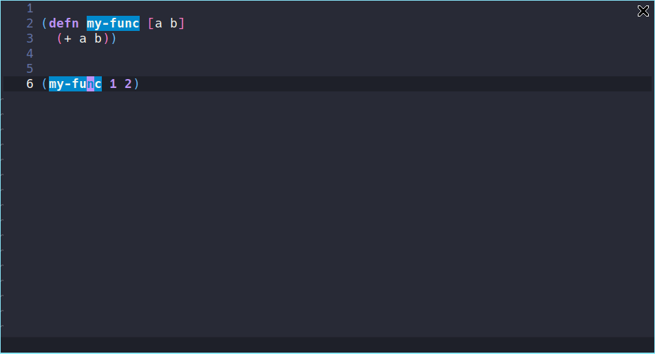
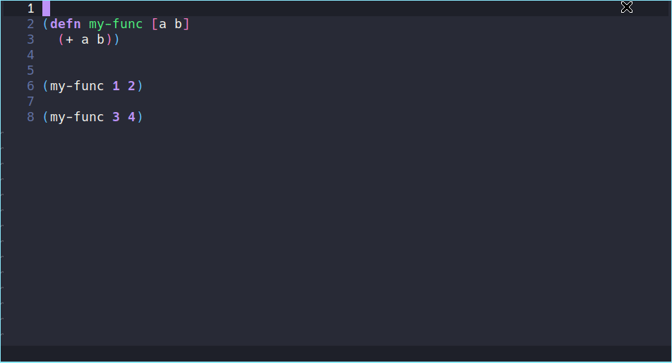
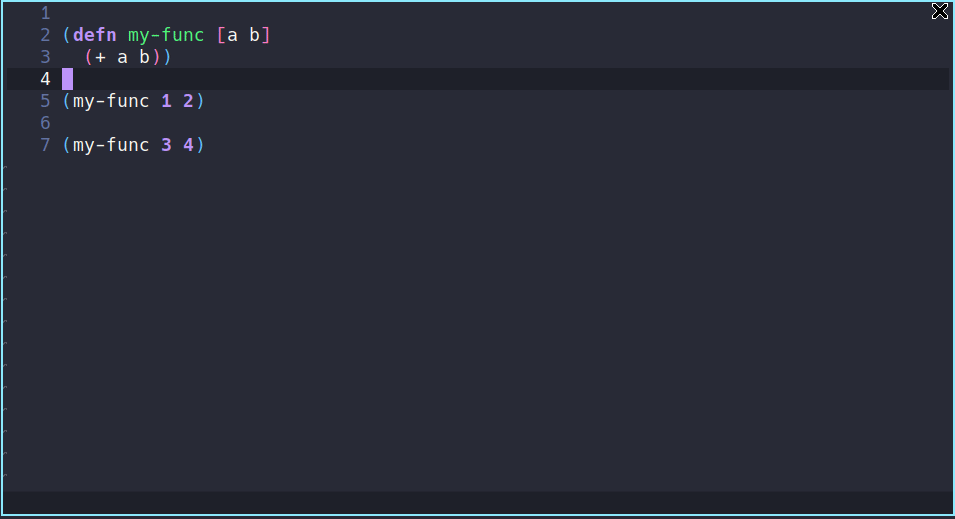
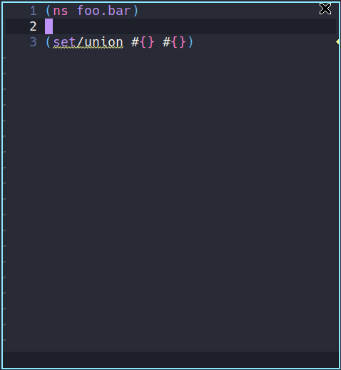
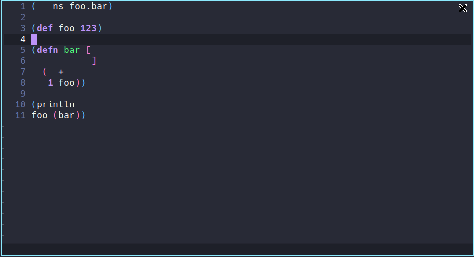
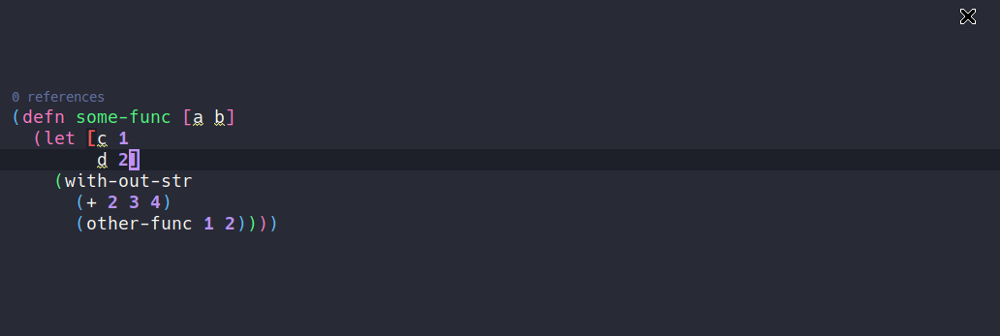
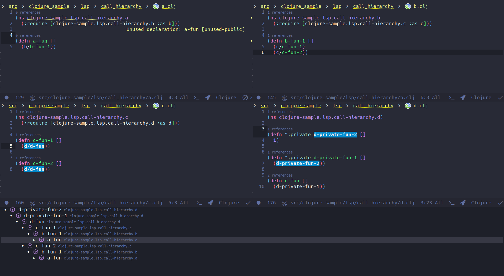

# Features

Above you can find all available features that clojure-lsp provide with examples using [Emacs lsp-mode](https://emacs-lsp.github.io/lsp-mode/) client.

### Find a function/var definition

### Find all references of a function, var, keyword or namespace alias

### Show all workspace/project symbols

### Show all symbols on current file

### Rename symbols

### Cursor hover showing symbol usages
### Code actions

| Name                               | Example                                                           |
|------------------------------------|-------------------------------------------------------------------|
| Clean namespace require/imports    |              |
| Inline symbol                      |         |
| Extract function                   |      |
| Add missing require                |   |
| Add known common require           |    |
| Add known common import            |     |
| Add suggested alias require        |  |
| Move to let                        |           |
| Change coll to map,vector,set,list |           |

### Code lenses showing symbol references

### Format a whole file or range

### Signature help

### Semantic tokens

Experimental: apply color on client editor for each known token

### Call hierarchy (Incoming only)

### Execute command

Commands that client can request. Some code actions use these commands as actions.

#### Refactoring

Commands that change/refactor the code, most of them are available via code actions.

##### Add import to namespace
##### Add missing namespace (available via code actions too)
##### Extract Function (available via code actions too)
##### Inline Symbol (available via code actions too)
##### Clean namespace (available via code actions too)
##### Cycle privacy of def/defn
##### Cycle collection (#{}, {}, [], ())
##### Change collection to {}, (), #{}, []
##### Expand let
##### Introduce let
##### Move expression to let
##### Thread first expression
##### Thread last expression
##### Thread first all
##### Thread last all
##### Unwind all
##### Unwind thread

#### Dev

##### Server information

Return basic information about the server.

##### Cursor information

Return debug information about the element at point.

### Custom message to client during any server process

During some process, `clojure-lsp` send messages to client informing some proccess, warning or error.
