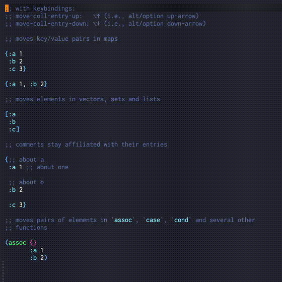

# Features

Above you can find all available features that clojure-lsp provides with examples using [Emacs lsp-mode](https://emacs-lsp.github.io/lsp-mode/) as the client.

### Find a function/var definition

### Find defprotocol implementations

### Find a function/var declaration in the ns

### Find all references of a function, var, keyword or namespace alias

### Show all workspace/project symbols

### Show all symbols on current file

### Rename symbols

Also, it's possible to live rename symbols on the same buffer with `linkedEditingRange` feature.

### Document highlight on hover showing symbol usages

### Documentation and clojuredocs integration

### Completion

#### Snippets

[Snippets](https://microsoft.github.io/language-server-protocol/specifications/specification-current/#snippet_syntax) are templates that make it easier to enter repeating code patterns, such as common functions/forms, they are available during completion. Tabstops are defined as `$number` with `$0` as last tabstop.

<strong>Check all available snippets here</strong>

<table>
<thead>
    <tr>
        <th>name</th>
        <th>description</th>
        <th>raw content</th>
    </tr>
</thead>
<tbody>
    <tr>
        <td><code>comment</code></td>
        <td>Insert comment block</td>
        <td><code>(comment\n  ${0:body}\n  )</code></td>
    </tr>
    <tr>
        <td><code>comment-heading</code></td>
        <td>Insert comment Header</td>
        <td><code>
    ;;;;;;;;;;;;;;;;;;;;;;;;;;;;;;;;;;;;;;;;;;
    ;; ${1:Namespace summary title}
    ;;
    ;; ${2:Brief description}\n;;;;;;;;;;;;;;;;;;;;;;;;;;;;;;;;;;;;;;;;;;\n\n$0
    </code></td>
    </tr>
    <tr>
        <td><code>comment-separator</code></td>
        <td>Insert comment separator</td>
        <td><code> ;; ${1:Namespace summary title}\n;;;;;;;;;;;;;;;;;;;;;;;;;;;;;;;;;;;;;;;;;;\n\n$0</code></td>
    </tr>
    <tr>
        <td><code>rich-comment</code></td>
        <td>Insert rich comment</td>
        <td>
<code>
(comment
  $0
#_())
</code></td>
    </tr>
    <tr>
        <td><code>rich-comment-rdd</code></td>
        <td>Insert rich comment rdd block</td>
        <td>
<code>
#_{:clj-kondo/ignore [:redefined-var]}
(comment
  $0
#_())
</code></td>
    </tr>
    <tr>
        <td><code>rich-comment-hotload</code></td>
        <td>Insert rich comment library hotload</td>
        <td>
<code>
#_{:clj-kondo/ignore [:redefined-var]}
(comment
 ;; Add-lib library for hot-loading
 (require '[clojure.tools.deps.alpha.repl :refer [add-libs]])
 (add-libs '{${1:domain/library-name} {:mvn/version \"${2:1.0.0}\"}$3}) 
 $0
)
</code></td>
    </tr>
    <tr>
        <td><code>condp</code></td>
        <td>Insert condp</td>
        <td><code>(condp ${1:pred} ${2:expr}\n $0)</code></td>
    </tr>
    <tr>
        <td><code>def</code></td>
        <td>Insert def</td>
        <td><code>(def ${1:name} $0)</code></td>
    </tr>
    <tr>
        <td><code>def-</code></td>
        <td>Insert def private</td>
        <td><code>(def ^:private ${1:name} $0)</code></td>
    </tr>
    <tr>
        <td><code>def-doc</code></td>
        <td>Insert def with docstring</td>
        <td><code>(def ${1:name}\n  \"${2:docstring}\"\n  $0)</code></td>
    </tr>
    <tr>
        <td><code>defmethod</code></td>
        <td>Insert defmethod</td>
        <td><code>(defmethod ${1:name} ${2:match}\n [${3:args}]\n $0)</code></td>
    </tr>
    <tr>
        <td><code>defmulti</code></td>
        <td>Insert defmulti</td>
        <td><code>(defmulti ${1:name} ${2:dispatch-fn})</code></td>
    </tr>
    <tr>
        <td><code>defn</code></td>
        <td>Insert public defn</td>
        <td><code>(defn ${1:name} [$2]\n  $0)</code></td>
    </tr>
    <tr>
        <td><code>defn-doc</code></td>
        <td>Insert public defn with docstring</td>
        <td><code>(defn ${1:name}\n  \"${2:docstring}\"\n   [${3:args}]\n  $0)</code></td>
    </tr>
    <tr>
        <td><code>defn-</code></td>
        <td>Insert private defn</td>
        <td><code>(defn%s ${1:name} [$2]\n  $0)</code></td>
    </tr>
    <tr>
        <td><code>defprotocol</code></td>
        <td>Insert defprotocol</td>
        <td><code>(defprotocol ${1:Name}\n $0)</code></td>
    </tr>
    <tr>
        <td><code>defrecord</code></td>
        <td>Insert defrecord</td>
        <td><code>(defrecord ${1:Name} [${2:fields}]\n ${3:Protocol}\n $0)</code></td>
    </tr>
    <tr>
        <td><code>deftype</code></td>
        <td>Insert deftype</td>
        <td><code>(deftype ${1:Name} [${2:fields}]\n ${3:Protocol}\n $0)</code></td>
    </tr>
    <tr>
        <td><code>fn</code></td>
        <td>Insert fn</td>
        <td><code>(fn [${1:arg-list}] $0)</code></td>
    </tr>
    <tr>
        <td><code>for</code></td>
        <td>Insert for</td>
        <td><code>(for [${1:item} ${2:coll}]\n  $0)</code></td>
    </tr>
    <tr>
        <td><code>if</code></td>
        <td>Insert if</td>
        <td><code>(if ${1:test-expr}\n ${2:then-expr}\n ${3:else-expr})</code></td>
    </tr>
    <tr>
        <td><code>kwargs</code></td>
        <td>Insert keyword args</td>
        <td><code>{:keys [${1:keys}] :or {${2:defaults}}}</code></td>
    </tr>
    <tr>
        <td><code>let</code></td>
        <td>Insert let</td>
        <td><code>(let [$0])</code></td>
    </tr>
    <tr>
        <td><code>letfn</code></td>
        <td>Insert letfn</td>
        <td><code>(letfn [(${1:name} [${2:args}]\n $0)])</code></td>
    </tr>
    <tr>
        <td><code>ns</code></td>
        <td>Insert ns</td>
        <td><code>(ns ${1:name}\n  $0:references})</code></td>
    </tr>
    <tr>
        <td><code>ns-doc</code></td>
        <td>Insert ns with docstring</td>
        <td><code>(ns ${1:name}\n  \"${2:docstring}\"\n  ${0:references})</code></td>
    </tr>
    <tr>
        <td><code>require</code></td>
        <td>Insert ns :require</td>
        <td><code>(:require [${1:namespace}])$0</code></td>
    </tr>
    <tr>
        <td><code>require-as</code></td>
        <td>Insert ns require with :as alias</td>
        <td><code>(:require [${1:namespace} :as ${2:alias}]$3)</code></td>
    </tr>
    <tr>
        <td><code>require-refer</code></td>
        <td>Insert ns :require with :refer</td>
        <td><code>(:require [${1:namespace} :refer [$2]]$3)</code></td>
    </tr>
    <tr>
        <td><code>require-rdd</code></td>
        <td>Insert require for rich comment experiments</td>
        <td><code>(require '[${1:namespace} :as ${2:alias}]$3)$0</code></td>
    </tr>
    <tr>
        <td><code>req-as</code></td>
        <td>Insert single require dep :as alias</td>
        <td><code>[${1:namespace} :as ${2:alias}]</code></td>
    </tr>
    <tr>
        <td><code>req-refer</code></td>
        <td>Insert single require dep with :refer</td>
        <td><code>[${1:namespace} :refer [$2]]</code></td>
    </tr>
    <tr>
        <td><code>import</code></td>
        <td>Insert import</td>
        <td><code>(:import [${1:package}])</code></td>
    </tr>
    <tr>
        <td><code>use</code></td>
        <td>Insert require refer preferred over use</td>
        <td><code>(:require [${1:namespace} :refer [$2]])</code></td>
    </tr>
    <tr>
        <td><code>deps-alias</code></td>
        <td>Insert alias with extra path & deps</td>
        <td>
<code>
:${1:category/name}
 {:extra-paths [\"${2:path}\"]
  :extra-deps {${3:deps-maven or deps-git}}}$0
</code></td>
    </tr>
    <tr>
        <td><code>deps-maven</code></td>
        <td>Insert maven dependency</td>
        <td><code>${1:domain/library-name} {:mvn/version \"${2:1.0.0}\"}$0</code></td>
    </tr>
    <tr>
        <td><code>deps-git</code></td>
        <td>Insert git dependency</td>
        <td>
<code>
${1:domain/library-name}
  {:git/sha \"${2:git-sha-value}\"}$0
</code></td>
    </tr>
    <tr>
        <td><code>deps-git-tag</code></td>
        <td>Insert git tag dependency</td>
        <td>
<code>
${1:domain/library-name}
 {:git/tag \"${2:git-tag-value}\"
  :git/sha \"${3:git-sha-value}\"}$0
</code></td>
    </tr>
    <tr>
        <td><code>deps-git-url</code></td>
        <td>Insert git URL dependency</td>
        <td>
<code>
${1:domain/library-name}
 {:git/url \"https://github.com/$1\"
  :git/sha \"${2:git-sha-value}\"}$0
</code></td>
    </tr>
    <tr>
        <td><code>deps-local</code></td>
        <td>Insert local dependency</td>
        <td>
<code> ${1:domain/library-name} {:local/root \"${2:/path/to/project/root}\"}$0 </code></td>
    </tr>
    <tr>
        <td><code>deftest</code></td>
        <td>Insert deftest clojure.test</td>
        <td>
<code> 
(deftest ${1:name}-test
  (testing \"${2:Context of the test assertions}\"
    (is (= ${3:assertion-values}))$4)) $0
</code></td>
    </tr>
    <tr>
        <td><code>testing</code></td>
        <td>Insert testing clojure.test</td>
        <td>
<code> 
(testing \"${1:Context of the test assertions}\"
  $0)
</code></td>
    </tr>
    <tr>
        <td><code>is</code></td>
        <td>Insert is clojure.test</td>
        <td><code>(is (= ${1:assertion-values}))</code></td>
    </tr>
</tbody>
</table>

##### Custom snippets

User can register additional custom snippets, for more information on how to configure it, check the [snippets settings section](https://clojure-lsp.io/settings/#snippets).

### Code actions

| Name                               | Example                                                              |
|------------------------------------|----------------------------------------------------------------------|
| Clean namespace require/imports    |                 |
| Add require                        |      |
| Add known common require           |       |
| Add known common import            |        |
| Add suggested alias require        |     |
| Create private function            |  |
| Resolve macro as...                |         |
| Inline symbol                      |            |
| Change coll to map,vector,set,list |              |
| Move coll entry up/down            |          |
| Move to let                        |              |
| Cycle privacy                      |                                                                      |
| Extract function                   |         |
| Thread first/all last              |         |
| Unwind thread                      |                                                                      |
| Sort map                           |                 |
| Suppress diagnostic                |                                                                      |
| Create test for function           |                                                                      |

### Code lenses showing symbol references

### Format a whole file or range

### Signature help

### Semantic tokens

The LSP server is the best to say what is the semantic value of a token on the editor, semantic tokens allows server return to client all tokens of a buffer and how client show apply highlight. 

Note: server return the semantic token (e.g. `function`) and the client/editor apply the color that matches the user's theme.

### Call hierarchy

Show the incoming or outgoing call hierarchy of a function/variable as a lazy tree

##### Incoming

Show functions that call the current one recursively

##### Outgoing

Show functions that the current one call, recursively

### Test Tree

Show the tests tree hierarchy of a file

### Diagnostics (linter)

All linters besides the ones below come from [clj-kondo](https://github.com/clj-kondo/clj-kondo) that clojure-lsp calls under the hood to lint the code and retrieve the analysis to
make most of features work.

Every linter configuration should be done on clj-kondo side, so anything related to unresolved symbols or unknown macros are probably related to wrong clj-kondo for the project. For more information on how to configure clj-kondo check [here](https://github.com/clj-kondo/clj-kondo/blob/master/doc/config.md#unrecognized-macros).

Below you can find the custom linters implemented on clojure-lsp side that uses the `:custom-lint-fn` from clj-kondo:

#### clojure-lsp/unused-public-var

For more information on how to configure it, check the [diagnostics settings section](https://clojure-lsp.io/settings/#diagnostics-linter).

### Stub generation

It's possible to configure clojure-lsp to generate and analyze stubs for specific namespaces available on your project classpath, this is useful for closed source dependencies like `datomic.api`, with that clojure-lsp will be able to make most features work with those dependencies.
For more information check the [stubs settings section](../settings.md#stub-generation).

### Execute command

Commands that client can request. Most code actions use these commands as actions.

#### Refactoring

Commands that change/refactor the code.

__Note: Most of them are available via code actions and most of the time you want to call the code action and not the command manually__

- Clean namespace *
- Add import to namespace
- Add missing require *
- Cycle privacy of def/defn *
- Cycle collection (#{}, {}, [], ())
- Change collection to {}, (), #{}, [] *
- Extract Function *
- Create private function *
- Inline Symbol *
- Expand let
- Introduce let
- Move expression to let
- Thread first expression
- Thread last expression
- Thread first all *
- Thread last all *
- Unwind all *
- Unwind thread
- Resolve macro as *
- Create test *
- Sort map *
- Move coll entry up *
- Move coll entry down *

#### Dev

##### Server information

Return basic information about the server.

##### Cursor information

Return debug information about the element at point.
