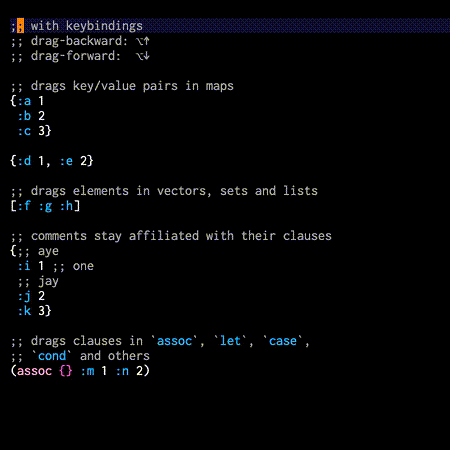
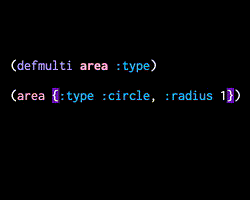
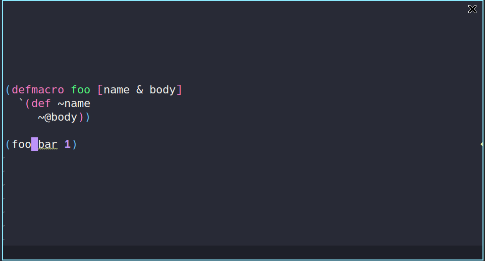
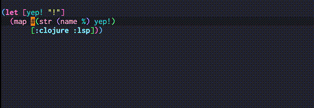

# Features

Below you can find all available features that clojure-lsp provides with examples using [Emacs lsp-mode](https://emacs-lsp.github.io/lsp-mode/) as the client.

- [Built in LSP features](#lsp-features)
- [clojure-lsp extra commands](#clojure-lsp-extra-commands)

## LSP features

### Find a function/var definition

### Find defprotocol/defmulti implementations

### Find a function/var declaration in the ns

### Find all references of a function, var, keyword or namespace alias

### Show all workspace/project symbols

### Show all symbols on current file

### Rename symbols

Also, it's possible to live rename symbols on the same buffer with `linkedEditingRange` feature.

### Document highlight on hover showing symbol usages

### Documentation and clojuredocs integration

### Java support

To understand what is supported and how to configure it, check the [settings section](settings.md#java-support).

### Completion

#### Snippets

[Snippets](https://microsoft.github.io/language-server-protocol/specifications/specification-current/#snippet_syntax) are templates that make it easier to enter repeating code patterns, such as common functions/forms, they are available during completion. Tabstops are defined as `$number` with `$0` as last tabstop.

<strong>Check all available snippets here</strong>

<table>
<thead>
    <tr>
        <th>name</th>
        <th>description</th>
        <th>raw content</th>
    </tr>
</thead>
<tbody>
    <tr>
        <td><code>comment</code></td>
        <td>Insert comment block</td>
        <td><code>(comment\n  ${0:body}\n  )</code></td>
    </tr>
    <tr>
        <td><code>comment-heading</code></td>
        <td>Insert comment Header</td>
        <td><code>;;;;;;;;;;;;;;;;;;;;;;;;;;;;;;;;;;;;;;;;;;\n;; ${1:Namespace summary title}\n;;\n;; ${2:Brief description}\n;;;;;;;;;;;;;;;;;;;;;;;;;;;;;;;;;;;;;;;;;;\n\n$0</code></td>
    </tr>
    <tr>
        <td><code>comment-separator</code></td>
        <td>Insert comment separator</td>
        <td><code> ;; ${1:Namespace summary title}\n;;;;;;;;;;;;;;;;;;;;;;;;;;;;;;;;;;;;;;;;;;\n\n$0</code></td>
    </tr>
    <tr>
        <td><code>rich-comment</code></td>
        <td>Insert rich comment</td>
        <td>
<code>
(comment
  $0
#_())
</code></td>
    </tr>
    <tr>
        <td><code>rich-comment-rdd</code></td>
        <td>Insert rich comment rdd block</td>
        <td>
<code>#_{:clj-kondo/ignore [:redefined-var]}\n(comment\n $0 #_())</code></td>
    </tr>
    <tr>
        <td><code>rich-comment-hotload</code></td>
        <td>Insert rich comment library hotload</td>
        <td>
<code>#_{:clj-kondo/ignore [:redefined-var]}\n(comment\n ;; Add-lib library for hot-loading\n (require '[clojure.tools.deps.alpha.repl :refer [add-libs]])\n (add-libs '{${1:domain/library-name} {:mvn/version \"${2:1.0.0}\"}$3})\n $0\n) </code></td>
    </tr>
    <tr>
        <td><code>condp</code></td>
        <td>Insert condp</td>
        <td><code>(condp ${1:pred} ${2:expr}\n $0)</code></td>
    </tr>
    <tr>
        <td><code>def</code></td>
        <td>Insert def</td>
        <td><code>(def ${1:name} $0)</code></td>
    </tr>
    <tr>
        <td><code>def-</code></td>
        <td>Insert def private</td>
        <td><code>(def ^:private ${1:name} $0)</code></td>
    </tr>
    <tr>
        <td><code>def-doc</code></td>
        <td>Insert def with docstring</td>
        <td><code>(def ${1:name}\n  \"${2:docstring}\"\n  $0)</code></td>
    </tr>
    <tr>
        <td><code>defmethod</code></td>
        <td>Insert defmethod</td>
        <td><code>(defmethod ${1:name} ${2:match}\n [${3:args}]\n $0)</code></td>
    </tr>
    <tr>
        <td><code>defmulti</code></td>
        <td>Insert defmulti</td>
        <td><code>(defmulti ${1:name} ${2:dispatch-fn})</code></td>
    </tr>
    <tr>
        <td><code>defn</code></td>
        <td>Insert public defn</td>
        <td><code>(defn ${1:name} [$2]\n  $0)</code></td>
    </tr>
    <tr>
        <td><code>defn-doc</code></td>
        <td>Insert public defn with docstring</td>
        <td><code>(defn ${1:name}\n  \"${2:docstring}\"\n   [${3:args}]\n  $0)</code></td>
    </tr>
    <tr>
        <td><code>defn-</code></td>
        <td>Insert private defn</td>
        <td><code>(defn%s ${1:name} [$2]\n  $0)</code></td>
    </tr>
    <tr>
        <td><code>defprotocol</code></td>
        <td>Insert defprotocol</td>
        <td><code>(defprotocol ${1:Name}\n $0)</code></td>
    </tr>
    <tr>
        <td><code>defrecord</code></td>
        <td>Insert defrecord</td>
        <td><code>(defrecord ${1:Name} [${2:fields}]\n ${3:Protocol}\n $0)</code></td>
    </tr>
    <tr>
        <td><code>deftype</code></td>
        <td>Insert deftype</td>
        <td><code>(deftype ${1:Name} [${2:fields}]\n ${3:Protocol}\n $0)</code></td>
    </tr>
    <tr>
        <td><code>fn</code></td>
        <td>Insert fn</td>
        <td><code>(fn [${1:arg-list}] $0)</code></td>
    </tr>
    <tr>
        <td><code>for</code></td>
        <td>Insert for</td>
        <td><code>(for [${1:item} ${2:coll}]\n  $0)</code></td>
    </tr>
    <tr>
        <td><code>if</code></td>
        <td>Insert if</td>
        <td><code>(if ${1:test-expr}\n ${2:then-expr}\n ${3:else-expr})</code></td>
    </tr>
    <tr>
        <td><code>kwargs</code></td>
        <td>Insert keyword args</td>
        <td><code>{:keys [${1:keys}] :or {${2:defaults}}}</code></td>
    </tr>
    <tr>
        <td><code>let</code></td>
        <td>Insert let</td>
        <td><code>(let [$0])</code></td>
    </tr>
    <tr>
        <td><code>letfn</code></td>
        <td>Insert letfn</td>
        <td><code>(letfn [(${1:name} [${2:args}]\n $0)])</code></td>
    </tr>
    <tr>
        <td><code>ns</code></td>
        <td>Insert ns</td>
        <td><code>(ns ${1:name}\n  $0:references})</code></td>
    </tr>
    <tr>
        <td><code>ns-doc</code></td>
        <td>Insert ns with docstring</td>
        <td><code>(ns ${1:name}\n  \"${2:docstring}\"\n  ${0:references})</code></td>
    </tr>
    <tr>
        <td><code>require</code></td>
        <td>Insert ns :require</td>
        <td><code>(:require [${1:namespace}])$0</code></td>
    </tr>
    <tr>
        <td><code>require-as</code></td>
        <td>Insert ns require with :as alias</td>
        <td><code>(:require [${1:namespace} :as ${2:alias}]$3)</code></td>
    </tr>
    <tr>
        <td><code>require-refer</code></td>
        <td>Insert ns :require with :refer</td>
        <td><code>(:require [${1:namespace} :refer [$2]]$3)</code></td>
    </tr>
    <tr>
        <td><code>require-rdd</code></td>
        <td>Insert require for rich comment experiments</td>
        <td><code>(require '[${1:namespace} :as ${2:alias}]$3)$0</code></td>
    </tr>
    <tr>
        <td><code>req-as</code></td>
        <td>Insert single require dep :as alias</td>
        <td><code>[${1:namespace} :as ${2:alias}]</code></td>
    </tr>
    <tr>
        <td><code>req-refer</code></td>
        <td>Insert single require dep with :refer</td>
        <td><code>[${1:namespace} :refer [$2]]</code></td>
    </tr>
    <tr>
        <td><code>import</code></td>
        <td>Insert import</td>
        <td><code>(:import [${1:package}])</code></td>
    </tr>
    <tr>
        <td><code>use</code></td>
        <td>Insert require refer preferred over use</td>
        <td><code>(:require [${1:namespace} :refer [$2]])</code></td>
    </tr>
    <tr>
        <td><code>deps-alias</code></td>
        <td>Insert alias with extra path & deps</td>
        <td>
<code>:${1:category/name}\n {:extra-paths [\"${2:path}\"]\n :extra-deps {${3:deps-maven or deps-git}}}$0</code></td>
    </tr>
    <tr>
        <td><code>deps-maven</code></td>
        <td>Insert maven dependency</td>
        <td><code>${1:domain/library-name} {:mvn/version \"${2:1.0.0}\"}$0</code></td>
    </tr>
    <tr>
        <td><code>deps-git</code></td>
        <td>Insert git dependency</td>
        <td>
<code>${1:domain/library-name}\n {:git/sha \"${2:git-sha-value}\"}$0 </code></td>
    </tr>
    <tr>
        <td><code>deps-git-tag</code></td>
        <td>Insert git tag dependency</td>
        <td>
<code>${1:domain/library-name}\n {:git/tag \"${2:git-tag-value}\"\n :git/sha \"${3:git-sha-value}\"}$0</code></td>
    </tr>
    <tr>
        <td><code>deps-git-url</code></td>
        <td>Insert git URL dependency</td>
        <td>
<code>${1:domain/library-name}\n {:git/url \"https://github.com/$1\"\n :git/sha \"${2:git-sha-value}\"}$0</code></td>
    </tr>
    <tr>
        <td><code>deps-local</code></td>
        <td>Insert local dependency</td>
        <td>
<code> ${1:domain/library-name} {:local/root \"${2:/path/to/project/root}\"}$0 </code></td>
    </tr>
    <tr>
        <td><code>deftest</code></td>
        <td>Insert deftest clojure.test</td>
        <td>
<code>(deftest ${1:name}-test\n  (testing \"${2:Context of the test assertions}\"\n  (is (= ${3:assertion-values}))$4)) $0</code></td>
    </tr>
    <tr>
        <td><code>testing</code></td>
        <td>Insert testing clojure.test</td>
        <td>
<code>(testing \"${1:Context of the test assertions}\"\n  $0)</code></td>
    </tr>
    <tr>
        <td><code>is</code></td>
        <td>Insert is clojure.test</td>
        <td><code>(is (= ${1:assertion-values}))</code></td>
    </tr>
</tbody>
</table>

##### Custom snippets

User can register additional custom snippets. For more information, check the [snippets config documentation](settings.md#snippets).

### Code actions

See [below](#clojure-lsp-extra-commands) for screenshots.

### Code lenses showing symbol references

### Format a whole file or range

### Signature help

### Semantic tokens

The LSP server is the best to say what is the semantic value of a token on the editor, semantic tokens allows server return to client all tokens of a buffer and how client show apply highlight.

Note: server return the semantic token (e.g. `function`) and the client/editor apply the color that matches the user's theme.

### Call hierarchy

Show the incoming or outgoing call hierarchy of a function/variable as a lazy tree

##### Incoming

Show functions that call the current one recursively

##### Outgoing

Show functions that the current one call, recursively

### Test Tree

Show the tests tree hierarchy of a file

### Project tree

Show the project tree ns and external dependencies.

### Diagnostics (linter)

All linters besides the ones below come from [clj-kondo](https://github.com/clj-kondo/clj-kondo) that clojure-lsp calls under the hood to lint the code and retrieve the analysis to
make most of features work.

Every linter configuration should be done on clj-kondo side, so anything related to unresolved symbols or unknown macros are probably related to wrong clj-kondo for the project. For more information on how to configure clj-kondo check [here](https://github.com/clj-kondo/clj-kondo/blob/master/doc/config.md#unrecognized-macros).

Below you can find the custom linters implemented on clojure-lsp side that uses the `:custom-lint-fn` from clj-kondo:

#### clojure-lsp/unused-public-var

For more information on how to configure it, check the [diagnostics settings section](settings.md#diagnostics-linter).

#### clojure-lsp/uniform-aliasing

For more information on how to configure it, check the [diagnostics settings section](settings.md#diagnostics-linter).

#### clj-depend

Clojure-lsp has a optional integration with [clj-depend](https://github.com/clj-depend/clj-depend), making it easier to configure namespaces relationship.

For more information on how to configure it, check the [diagnostics settings section](settings.md#diagnostics-linter).

### Stub generation

It's possible to configure clojure-lsp to generate and analyze stubs for specific namespaces available on your project classpath, this is useful for closed source dependencies like `datomic.api`, with that clojure-lsp will be able to make most features work with those dependencies.
For more information check the [stubs settings section](settings.md#stub-generation).

### Execute command

Commands that client can request. Most code actions use these commands as actions.

## clojure-lsp extra commands

__Note: Most of these are available via code actions and clients or users may choose to use the code action menu to execute them instead of mapping.__

All functions in clojure-lsp have a two-letter mnemonic shortcut. E.g. `tf` for `thread-first-all`. We __strongly__ suggest that client authors and users use these shortcuts keys when choosing to map these commands to key chords or menus; this allows for users to maintain muscle memory and familiarity as they switch between clients and editors. Thank you to [clj-refactor](https://github.com/clojure-emacs/clj-refactor.el#usage) for this system and other tools that adhere to it.

LSP clients will allow you to bind these commands to shortcuts or menu items using LSP's `workspace/executeCommand` and passing a map with `"command"` and `"arguments"` keys.

Arguments:
- `file-uri`: Absolute file uri. e.x. `file:///home/user/project/src/main.clj`
- `row`: line-number of the cursor, 0 based.
- `col`: col-number of the cursor, 0 based.
- `name`: Used when introducing a name, usually a string for a valid clojure symbol.
- `filename`: Filename path. e.x. `src/utils.clj`

| Shortcut | Command                      | Name                                      | Arguments                                        | Available via code action | Example                                                                                                                                                   |
|----------|------------------------------|-------------------------------------------|--------------------------------------------------|---------------------------|-----------------------------------------------------------------------------------------------------------------------------------------------------------|
| ab       | drag-param-backward          | Drag param backward                       | `[file-uri,row,col]`                             | ✅                        |                                   |
| af       | drag-param-forward           | Drag param forward                        | `[file-uri,row,col]`                             | ✅                        |                                   |
| ai       | add-missing-import           | Add import to namespace                   | `[file-uri,row,col[,name]]`                      | ✅                        |                             |
| am       | add-missing-libspec          | Add missing require                       | `[file-uri,row,col]`                             | ✅                        |                             |
| as       | add-require-suggestion       | Add require suggestion                    | `[file-uri,row,col,ns,alias,refer]`              | ✅                        |                        |
| cc       | cycle-coll                   | Cycle collection `(#{}, {}, [], ())`      | `[file-uri,row,col]`                             | ✅                        |                                                                                                                                                           |
| ck       | cycle-keyword-auto-resolve   | Cycle keyword auto-resolve                | `[file-uri,row,col]`                             | ✅                        |        |
| cn       | clean-ns                     | Clean namespace                           | `[file-uri,row,col]`                             | ✅                        |                                                       |
| cp       | cycle-privacy                | Cycle privacy of def/defn                 | `[file-uri,row,col]`                             | ✅                        |                                                                                                                                                           |
| ct       | create-test                  | Create test                               | `[file-uri,row,col]`                             | ✅                        |                                                                                                                                                           |
| df       | demote-fn                    | Demote fn to #()                          | `[file-uri,row,col]`                             | ✅                        |                                                  |
| db       | drag-backward                | Drag backward                             | `[file-uri,row,col]`                             | ✅                        |                                                     |
| df       | drag-forward                 | Drag forward                              | `[file-uri,row,col]`                             | ✅                        |                                                     |
| dk       | destructure-keys             | Destructure keys                          | `[file-uri,row,col]`                             | ✅                        |                                      |
| ed       | extract-to-def               | Extract to def                            | `[file-uri,row,col,name]`                        | ✅                        |                                            |
| ef       | extract-function             | Extract function                          | `[file-uri,row,col,name]`                        | ✅                        |                                      |
| el       | expand-let                   | Expand let                                | `[file-uri,row,col]`                             |                           |                                                                                                                                                           |
| fe       | create-function              | Create function from example              | `[file-uri,row,col]`                             | ✅                        |            |
| ga       | get-in-all                   | Move all expressions to get/get-in        | `[file-uri,row,col]`                             | ✅                        |                                                     |
| gl       | get-in-less                  | Remove one element from get/get-in        | `[file-uri,row,col]`                             | ✅                        |                                                     |
| gm       | get-in-more                  | Move another expression to get/get-in     | `[file-uri,row,col]`                             | ✅                        |                                                     |
| gn       | get-in-none                  | Unwind whole get/get-in                   | `[file-uri,row,col]`                             | ✅                        |                                                     |
| il       | introduce-let                | Introduce let                             | `[file-uri,row,col,name]`                        |                           |                                                                                                                                                           |
| is       | inline-symbol                | Inline Symbol                             | `[file-uri,row,col]`                             | ✅                        |                                               |
| ma       | resolve-macro-as             | Resolve macro as                          | `[file-uri,row,col]`                             | ✅                        |                                      |
| mf       | move-form                    | Move form                                 | `[file-uri,row,col,filename]`                    | ✅                        |                                                                                                                                                           |
| ml       | move-to-let                  | Move expression to let                    | `[file-uri,row,col,name]`                        | ✅                        |                                          |
| pf       | promote-fn                   | Promote #() to fn, or fn to defn          | `[file-uri,row,col,fn-name]`                     | ✅                        |                                                |
| rr       | replace-refer-all-with-refer | Replace ':refer :all' with ':refer [...]' | `[file-uri,row,col,refers]`                      | ✅                        |  |
| ra       | replace-refer-all-with-alias | Replace ':refer :all' with alias          | `[file-uri,row,col]`                             | ✅                        |  |
| rk       | restructure-keys             | Restructure keys                          | `[file-uri,row,col]`                             | ✅                        |                                      |
| sc       | change-coll                  | Switch collection to `{}, (), #{}, []`    | `[file-uri,row,col,"map"/"list"/"set"/"vector"]` | ✅                        |                                               |
| sl       | sort-clauses                 | Sort map/vector/list/set/clauses          | `[file-uri,row,col]`                             | ✅                        |                                                  |
| tf       | thread-first-all             | Thread first all                          | `[file-uri,row,col]`                             | ✅                        |                                      |
| th       | thread-first                 | Thread first expression                   | `[file-uri,row,col]`                             |                           |                                                                                                                                                           |
| tl       | thread-last-all              | Thread last all                           | `[file-uri,row,col]`                             | ✅                        |                                                                                                                                                           |
| tt       | thread-last                  | Thread last expression                    | `[file-uri,row,col]`                             |                           |                                                                                                                                                           |
| ua       | unwind-all                   | Unwind whole thread                       | `[file-uri,row,col]`                             | ✅                        |                                                                                                                                                           |
| uw       | unwind-thread                | Unwind thread once                        | `[file-uri,row,col]`                             |                           |                                                                                                                                                           |
| fs       | forward-slurp                | Paredit: forward slurp                    | `[file-uri,row,col]`                             |                           |                                                                                                                                                           |
| fb       | forward-barf                 | Paredit: forward barf                     | `[file-uri,row,col]`                             |                           |                                                                                                                                                           |
| bs       | backward-slurp               | Paredit: backward slurp                   | `[file-uri,row,col]`                             |                           |                                                                                                                                                           |
| bb       | backward-barf                | Paredit: backward barf                    | `[file-uri,row,col]`                             |                           |                                                                                                                                                           |
| rs       | raise-sexp                   | Paredit: Raise sexp                       | `[file-uri,row,col]`                             |                           |                                                                                                                                                           |
| ks       | kill-sexp                    | Paredit: Kill sexp                        | `[file-uri,row,col]`                             |                           |                                                                                                                                                           |

## Dev

##### Server information

Return basic information about the server.

##### Cursor information

Return debug information about the element at point.
